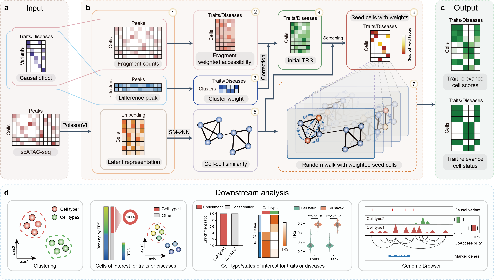

# SCIV

> SCIV: Unveiling the pivotal cell types involved in variant function regulation at a single-cell resolution

We propose SCIV, a method integrating cell cluster-type correction with a weighted seed-based random walk. By eliminating substantial noise from seed cells, SCIV enables the efficient enrichment of causal variants within cells of interest.

> SCIV tutorial: https://sciv.readthedocs.io/en/latest/
